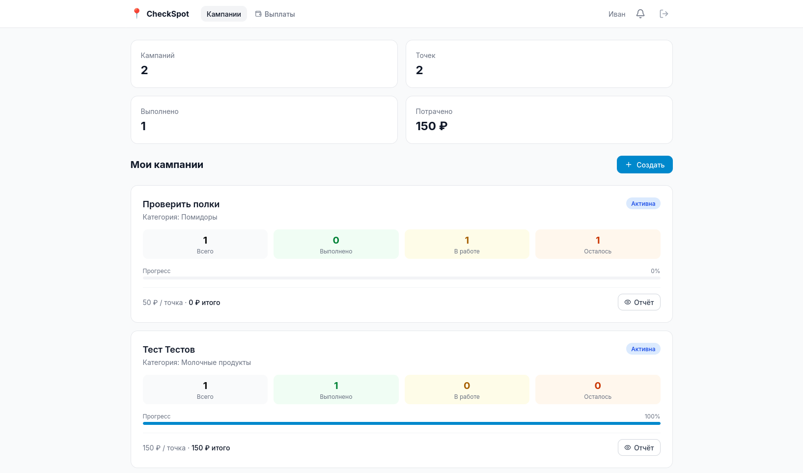
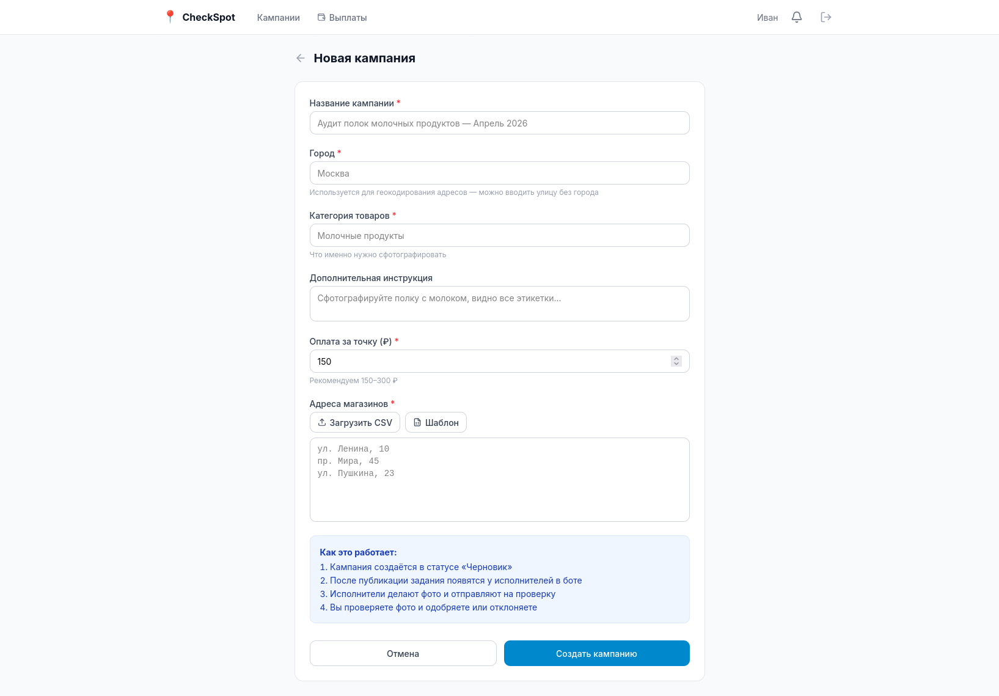

# CheckSpot

Платформа для проверки выкладки товаров в торговых точках. Компании создают кампании с заданиями — исполнители приходят в магазин, фотографируют полки через Telegram-бот и получают оплату за каждое принятое фото.





## Стек

| | |
|---|---|
| Backend | Python 3.12, FastAPI, SQLAlchemy 2 (async), Alembic |
| Telegram Bot | aiogram 3, webhook через FastAPI |
| База данных | PostgreSQL 16 |
| Frontend | React 18, Vite, Tailwind CSS, shadcn/ui |
| Авторизация | JWT (дашборд) + Telegram user_id (бот) |
| Геокодирование | 2GIS API (fallback: Nominatim) |
| Деплой | Railway (бэкенд) + Vercel (фронтенд) |

## Структура

```
backend/    FastAPI + aiogram + бизнес-логика
frontend/   React-дашборд для заказчиков
```

## Запуск локально

**1. База данных**

```bash
docker compose up -d
```

**2. Бэкенд**

```bash
cd backend
cp .env.example .env  # заполнить TELEGRAM_BOT_TOKEN и JWT_SECRET
pip install -r requirements.txt
alembic upgrade head
uvicorn app.main:app --reload
```

**3. Фронтенд**

```bash
cd frontend
npm install
npm run dev
```

Дашборд: `http://localhost:5173` — API: `http://localhost:8000`

## Переменные окружения

Все переменные в `backend/.env.example`. Обязательные:

| Переменная | Описание |
|---|---|
| `DATABASE_URL` | PostgreSQL connection string |
| `JWT_SECRET` | Секрет для JWT (min 32 символа) |
| `TELEGRAM_BOT_TOKEN` | Токен бота из BotFather |
| `TWOGIS_API_KEY` | API-ключ 2GIS для геокодирования адресов |

Для локальной разработки `WEBHOOK_URL` не нужен — бот запустится в polling-режиме.

## Медиа

Фото хранятся в `MEDIA_DIR` (по умолчанию `./media/photos`). На Railway использовать Volume — без него файлы сбросятся при редеплое.
